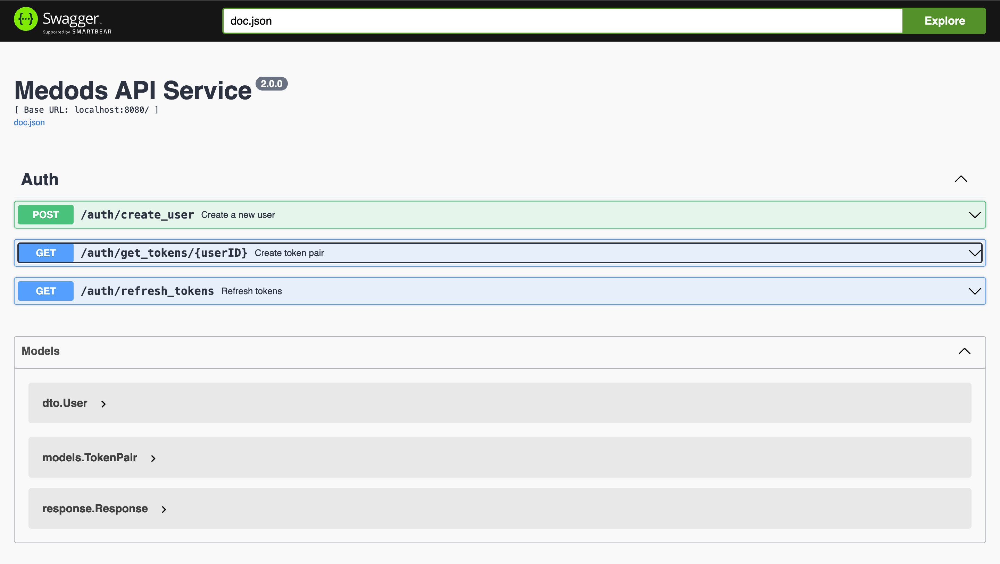

# Medods


- [О проекте](#о-проетке)
- [Настройка](#настройка)
- [Запуск](#запуск)
- [Использование](#использование)


## О проетке

Сиситема авторизации пользователей через JWT токены с проверкой ip адреса

## Настройка

Для конфигурации проекта необходимо внести изменения в yaml файлы которые находятся в директории `/config`

Для замены файла конфигурации в проекте при локальном запуске необходимо изменить путь к файлу при помощи флага `config`

```bash
go run cmd/main.go --config=config/local.yaml
```
Или изменить конфиг по умолчанию (config/docker.yaml) в файле `cmd/main.go`

```go
configPath := flag.String("config", "config/docker.yaml", "path to config file")
```

## Запуск

### Локальный запуск

Для локального запуска проекте необходимо в корне проекта ввести команду

```bash
go run cmd/main.go --config=config/local.yaml
```
### Тесты

Для запуска тестов необходимо внести изменения в файл конфигурации, который располагается по пути `config/test.yaml`

После в корне проекта выполнить команду
```bash
go clean -testcache & \
go test -v ./tests/...
```

### Запуск через Docker

Для запуска через Docker необходимо в корне проекта выполнить команду

```bash
docker-compose up -d --build
```
Для остановки контейнера необходимо выполнить команду
```bash
docker-compose down -v
```

## Использование

Все запросы можно посмотреть в Swagger докуметации которая находится по ссылке (замените id_address на тот который указан в вашем конфигурационном файле или используйте localhost):

```url
http://{ip_address}:8080/swagger/index.html
```


